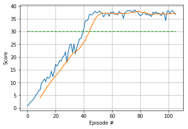

# Project - Deep Reinforcement Learnning p2 - Continuous Control - following a moving target
## The Problem - Project Goal

1. In this environment, a double-jointed arm can move to target locations. 
2. A reward of +0.1 is provided for each step that the agent's hand is in the goal location. Thus, the goal of the agent is to maintain its position at the target location for as many time steps as possible.
3. The observation space consists of 33 variables corresponding to position, rotation, velocity, and angular velocities of the arm. 
4. Each action is a vector with four numbers, corresponding to torque applicable to two joints. Every entry in the action vector should be a number between -1 and 1.

## Implementation Details
1. I decided to go with the [DDPG algorithm](https://arxiv.org/pdf/1509.02971.pdf). 
2. The Actor and Critc networks are almost identical and simple -  linear layers followed by RELU Activation layers.
3. A finite sized cache called the replay buffer has been used to store <s,a,r,s'> pairs. Pairs from this buffer are used to train the actor and the critic.
4. The concept of soft updates has been used for both actor and critic networks where a copy of the networks is used for evaluation and updated at regular intervals with the weights from the target network being trained.
5. Exploration (which is a major challenge in continuous actions spaces) by adding noise to the action spaces is done by using an Ornstein-Uhlenbeck process.
6. Loss functions for both networks as mentioned in the paper

### Network Architecture
I first setup the network as mentioned in the paper for both the Actor and Critic but through experiments, finally settled on the below mentioned values.

1. Both actor and critic have 2 hidden layers
2. Dimension of hidden layer1 = 330, hidden layer 2 = 300
3. Size of input to both networks is the state size = 33
4. Actions were included for the Critic network only in the second layer
5. The Actor outputs actions with action size = 4 
6. Critic outputs the Q value for a state, action pair
7. Adam optimiser for both networks
8. A replay buffer of size 100000. As the buffer gets full, old entries are replaced.
9. Discount factor 0.99

### Hyperparamters
1. Learning rate for both networks = 0.001
2. Tau for soft updates = 0.05
3. Weight decay for Critic = 0
4. Batch size - 128

### Plot 
Below is the plot that shows how the agents trainied.

### Future Work - ideas
1. Implement the D4PG, A3C algorithm and compare with this DDPG performance
2. Imlement a prioritised Replay buffer 
3. Further tweak the network parameters for faster training and a higher target score.
